# Language Practicing Application

This is an application designed to be used for learning new words when studying a language. The application consists of four components, namely [**Server**](#server-section), [**WebAdminUI**](#admin-ui-section), [**Mobile App**](#mobile-app-section) and [**WordCrawler**](#crawler-section). Server is responsible from storing the words, languages, word categories, users and communicating with the other components. WebAdminUI is a web page where a user
can add/remove/edit words to be practiced as well as languages and word categories. By using the Mobile App, a user can practice those words and finally WordCrawler can be used to add new words to the database in a fast and easy way. Those components will be explained in detail in this document.

Java Spring Boot, Cordova, Angular, jQuery and MongoDB were used for this project.

## Credits

The icons for the words, languages, users and word categories that you will see in the screenshots are made by the followings:

<div>Icons made by <a href="https://www.flaticon.com/authors/eucalyp" title="Eucalyp">Eucalyp</a> from <a href="https://www.flaticon.com/" 			    title="Flaticon">www.flaticon.com</a> is licensed by <a href="http://creativecommons.org/licenses/by/3.0/" 			    title="Creative Commons BY 3.0" target="_blank">CC 3.0 BY</a></div>

<div>Icons made by <a href="https://www.flaticon.com/authors/smashicons" title="Smashicons">Smashicons</a> from <a href="https://www.flaticon.com/" 			    title="Flaticon">www.flaticon.com</a> is licensed by <a href="http://creativecommons.org/licenses/by/3.0/" 			    title="Creative Commons BY 3.0" target="_blank">CC 3.0 BY</a></div>

<div>Icons made by <a href="https://www.freepik.com/" title="Freepik">Freepik</a> from <a href="https://www.flaticon.com/" 			    title="Flaticon">www.flaticon.com</a> is licensed by <a href="http://creativecommons.org/licenses/by/3.0/" 			    title="Creative Commons BY 3.0" target="_blank">CC 3.0 BY</a></div>

<div>Icons made by <a href="https://www.flaticon.com/authors/ddara" title="dDara">dDara</a> from <a href="https://www.flaticon.com/" 			    title="Flaticon">www.flaticon.com</a> is licensed by <a href="http://creativecommons.org/licenses/by/3.0/" 			    title="Creative Commons BY 3.0" target="_blank">CC 3.0 BY</a></div>

<div>Icons made by <a href="https://www.flaticon.com/authors/surang" title="surang">surang</a> from <a href="https://www.flaticon.com/" 			    title="Flaticon">www.flaticon.com</a> is licensed by <a href="http://creativecommons.org/licenses/by/3.0/" 			    title="Creative Commons BY 3.0" target="_blank">CC 3.0 BY</a></div>

## Requirements and Instructions to Run

In this section, the requirements and instructions on how to run each component will be given.

### Server

The server has the following dependencies:

* Java 8 
* MongoDB

MongoDB must be started before running the server.

After installing those two dependencies, a compiled WAR file can be found in /Server/languageAppServer.war. It can be run by the following command:

```
java -jar /Server/languageAppServer.war
```

### WebAdminUI

Web Admin UI requires Node.js and npm. Those can be installed at [**the NPM website**](https://www.npmjs.com/get-npm).

After installing the dependencies, to run the Admin UI, you should open the command line on the AdminUI folder and execute the following commands:

```
npm install
```

This command is just to install the required JS libraries for the component and it should be run only one time. After that it is not necessary to execute it again. After this command is executed, run the following command to start the Admin UI component:

```
ng serve
```

When it is done, the Admin UI can be accessed by URL **"http://localhost:4200"**. For login, username "user1" and password "user1" can be used (this is the user which is created by the server as default and can be changed by editing /Server/src/main/java/project/languageapp/ServerApplication.java).

### Mobile Application

The mobile application requires Node.js, npm and Apache Cordova. Node.js and npm should be already installed for the AdminUI. For installing Apache Cordova, the following command can be used:

```
npm install -g cordova
```

After installing Apache Cordova, the plugins and other dependencies for the mobile application component must be installed. For doing that, execute the following commands on /MobileApp folder.

``` 
npm install
cordova platform add android
```

Note that Apache Cordova cannot work with Java 9 or newer versions so Java 8 must be installed and JAVA_HOME environment variable must be pointing to Java 8. 

The commands above should be enough to install all dependencies. After that the following command will create an APK file which can be used to install the mobile application to an Android phone.

``` 
cordova build android
``` 

Also, a compiled APK file is provided in the repository, you can find it at /MobileApp/app-debug.apk


### Restoring the Provided Database

Initially, the database is empty (only a user with username = user1 and password = user1 is created automatically when the server is run), however, if you wish, you can initialize the database provided in this repository in your computer so you will start with some languages, words and word categories.

The files that are required to restore the database are language_app_db.zip and dbfiles.zip. The following instructions will explain how to do that.

<ul>
<li> Uncompress dbfiles.zip, replace /Server/dbfiles folder with the dbfiles folder that is extracted from this ZIP file.</li>
<li> Uncompress language_app_db.zip, then run the following command:</li>
</ul>

``` 
mongorestore -d language_app language_app_db
```

## <a name="server-section"></a>Server

The server provides a REST API for the other components and responsible for managing the database. 

First of all, there are four main object types: [**User**](#user-class), [**Language**](#language-class), [**Category**](#category-class) and [**Word**](#word-class). The structure for all object types will be explained below:

### <a name="user-class"></a>User Class

Here is the important class properties for User class:

    String id;
    String username
    String password;
    String realName;
    String pictureURL;
    Map<String, LanguageStatus> languages;
    List<String> languageIDs;
    List<String> currentLanguageIDs;
    List<String> mainLanguageIDs;
    ...

For each user, an object of user class is created. The User object keeps credentials (_username_, _password_), user-related information (_realName_, _pictureURL_ which is a string that shows where the icon for the user is stored) and language-related information (_languages_, _languageIDs_, _currentLanguageIDs_, _mainLanguageIDs_). 

Regarding the language-related information, _currentLanguageIDs_ keeps the ID of the [language](#language-class) which this user is currently practicing and _mainLanguageIDs_ keeps the ID of the [language](#language-class) which is the native language of this user. There are some refactorings to do related with those properties [[1]](#user-refactor-one). Finally _languages_ is a map which gets ID of a [language](#language-class) as key and the state (LanguageStatus) of this user for this language as corresponding value. 

In LanguageStatus class, the most important property is   _assignedWords_ which is a map of string to object and _languageID_ which keeps the ID of the [language](#language-class) that the LanguageStatus object is created for. There will be some refactorings to do related with LanguageStatus class [[2]](#user-refactor-one). The most important properties of the current version of LanguageStatus class is shown below:

    Map<String, Object> assignedWords;
    String languageID;
	 ...

Here, _assignedWords_ keeps IDs of [words](#word-class) which were selected by the user to be practiced for the language whose ID is kept at _languageID_ property. For instance, assuming that a user wants to practice the words "table" and "chair" for English language and there are [word](#word-class) objects such as 

```
{id:"word_1", name:"table", ...}
{id:"word_2", name"chair", ...} 
```
and [language](#language-class) object such as 

```
{id:"lang_1", name:"English"}
``` 
the corresponding LanguageStatus object would be the following: (keys of the _assignedWords_ map are always word IDs and values of the _assignedWords_ map are always null)

```
{
	languageID: "lang_1",
	assignedWords: {
		"word_1": null,
		"word_2": null
	}
}
```

Here an example User object retrieved from production is shown:

```
{
    "_id" : ObjectId("5c117485e101ed043ebf8a82"),
    "username" : "user1",
    "password" : "user1",
    "realName" : "user1",
    "languages" : {
        "5be35a3f2e2bce040c9b74d5" : {
            "languageID" : "5be35a3f2e2bce040c9b74d5",
            "assignedWords" : {
                "5c019e271617960332250e93" : null
            },
            "version" : 2
        },
        "5beb4edf1ada5b052b84e6cf" : {
            "languageID" : "5beb4edf1ada5b052b84e6cf",
            "assignedWords" : {},
            "version" : 1
        }
    },
    "languageIDs" : [ 
        "5be35a3f2e2bce040c9b74d5", 
        "5beb4edf1ada5b052b84e6cf"
    ],
    "currentLanguageIDs" : [ 
        "5be35a3f2e2bce040c9b74d5"
    ],
    "mainLanguageIDs" : [ 
        "5beb4edf1ada5b052b84e6cf"
    ],
    "version" : 2,
    "pictureURL" : "language/users/user1.gif",
}
```

<sub><a name="user-refactor-one"></a>[1]: Although both _currentLanguageIDs_, _mainLanguageIDs_ are lists, they always consist of only one element. In the next version of the server, those class properties will be converted from List of String into String. Also, _languageIDs_ is a useless property, so in the next version of the server it will be removed.</sub>

<sub><a name="user-refactor-two"></a>[2]: It is planned that a value of _assignedWords_ map will keep some statistics for the corresponding word (and the user that owns the LanguageStatus object). For example, the number of exercises that the user encountered for this word, the number of wrong and correct answers from the user for this word, the last time the user performed an exercise for this word, ... will be kept. Currently we just keep a null object instead but in the next version of the server, this is planned to be implemented. </sub>

### <a name="language-class"></a>Language Class

Here is the important class properties for Language class:

    String id;
    String name;
    String alphabet;
    String pictureURL;
    List<PronounType> pronouns;
    List<VerbType> verbs;
    List<NounType> nouns;
    List<AdjectiveType> adjectives;
    ...

For each language, an object of Language class is created. The Language object keeps the following properties:

* **_name_**: This is the name of the language such as "English" or "Swedish".

* **_alphabet_**: The string that contains all letters that the language uses (each letter should appear in this property exactly one time)

* **_verbs_**, **_nouns_**, **_adjectives_**, **_pronouns_**: Those properties keep data about different verb, noun, adjective and pronoun types for the language. For example, considering verbs, there are verbs in "past simple tense" and "present simple tense" (among many other tenses) in English. So for a language object for English language, _verbs_ property would have the following value: 

```
[
	{name: "past simple"},
	{name: "present simple"},
	...
]
```
Note that VerbType, NounType and AdjectiveType are very simple classes, they have only _name_ as a class property. PronounType class has _name_ and _group_ as class properties. In the language, if any verb has the exact same form for two pronouns in any tense, then those two prononus must have the same group. For example, for English, pronouns "he", "she" and "it" are in the same group and "you", "we", "they" are in the same group. The pronoun "I" is in another group on its own (consider the forms of the verb "to be" in present simple tense for different pronouns). It is a good idea to add only the forms which are worth practicing. For example, for English, past continous tense (such as "was going") is not worth practicing because if one knows a verb in present continuous tense then he/she almost automatically knows the same verb in past continous tense as well.   

* **_pictureURL_**: A string which shows where the icon for the language is stored.

Two example Language objects (an object for Swedish language and English language) is given below (the letters in the _alphabet_ property can be ordered in any way):

```
"_id" : ObjectId("5be35a3f2e2bce040c9b74d5"),
"name" : "Swedish",
"alphabet" : "bcdfghjklmnpqrstvwxzaeiouyåäö",
"pronouns" : [ 
    {
        "name" : "Jag",
        "group" : "0"
    }, 
    {
        "name" : "Du",
        "group" : "0"
    }, 
    {
        "name" : "Han",
        "group" : "0"
    }, 
    {
        "name" : "Hon",
        "group" : "0"
    }, 
    {
        "name" : "Vi",
        "group" : "0"
    }, 
    {
        "name" : "Ni",
        "group" : "0"
    }, 
    {
        "name" : "De",
        "group" : "0"
    }
],
"verbs" : [ 
    {"name" : "Presens"}, 
    {"name" : "Preteritum"}, 
    {"name" : "Perfekt"}, 
    {"name" : "Infinitiv"}, 
    {"name" : "Imperativ"}
],
"nouns" : [ 
    {"name" : "bestämd-singular"}, 
    {"name" : "bestämd-plural"}, 
    {"name" : "obestämd-singular"}, 
    {"name" : "obestämd-plural"}
],
"adjectives" : [ 
    {"name" : "-en singular"}, 
    {"name" : "-ett singular"}, 
    {"name" : "bestämd"}
],
"pictureURL" : "language/languages/5be35a3f2e2bce040c9b74d5_3.jpg"
```

```
{
    "_id" : ObjectId("5beb4edf1ada5b052b84e6cf"),
    "name" : "English",
    "alphabet" : "abcdefghijklmnopqrstuvwxyz",
    "pronouns" : [ 
        {
            "name" : "I",
            "group" : "0"
        }, 
        {
            "name" : "You",
            "group" : "1"
        }, 
        {
            "name" : "He",
            "group" : "2"
        }, 
        {
            "name" : "She",
            "group" : "2"
        }, 
        {
            "name" : "It",
            "group" : "2"
        }, 
        {
            "name" : "We",
            "group" : "1"
        }, 
        {
            "name" : "They",
            "group" : "1"
        }
    ],
    "verbs" : [ 
        {"name" : "simple-present"}, 
        {"name" : "simple-past"}, 
        {"name" : "continuous-present"}, 
        {"name" : "perfect-present"}, 
        {"name" : "infinite"}
    ],
    "nouns" : [ 
        {"name" : "singular"}, 
        {"name" : "plural"}
    ],
    "adjectives" : [ 
        {"name" : "normal"}
    ],
    "version" : 2,
    "pictureURL" : "language/languages/5beb4edf1ada5b052b84e6cf_1.jpg",
}
```

### <a name="category-class"></a>Category Class

Here is the important class properties for Category class:

    String id;
    String pictureURL;
    String name;
    List<String> wordIDs;
    
For each category, an object of Category class is created. The Category object keeps the following properties:

* **_name_**: The title of the category.

* **_pictureURL_**: A string which shows where the icon for the category is stored.

* **_wordIDs_**: List of IDs of words that belong to this category.

An example category object is given below:

```
{
    "_id" : ObjectId("5beb53061ada5b052b84e6d1"),
    "name" : "Colors",
    "wordIDs" : [ 
        "5c019e271617960332250e93"
    ],
    "version" : 1,
    "pictureURL" : "language/categories/5beb53061ada5b052b84e6d1_1.jpg",
}
```

### <a name="word-class"></a>Word Class

Here is the important class properties for Word class:

    String id;
    String pictureURL;
    String name;
    Map<String, String> meanings;
    WordType type;
    Integer level;
    List<String> categories;
    Map<String, Map<String, Object>> data;
	 ...

For each word, an object of Word class is created. The Word object keeps the following properties:

* **_name_**: This is just an identifier for the word and it can be any string but generally it is a good idea to just give the word in English as the value for this property.

* **_pictureURL_**: A string which shows where the icon for the word is stored.

* **_meanings_**: This keeps the information about how to say this word in neutral form in other languages. For example, assume we have a Word object for the word "table" ("table" is "bord" in Swedish) and we have two objects of [Language](#language-class) class such as

```
{id:"lang_1", name:"English"}
{id:"lang_2", name:"Swedish"}
``` 
In this case, the _meanings_ property would be:

```
{
	"lang_1": "table",
	"lang_2": "bord"
}
```
* **_type_**: Keeps the type of the word, can be ADJECTIVE, NOUN or VERB. [[1]](#word-refactor-one)

* **_level_**: Keeps the hardness level of the word (the bigger the level is, the more advanced the word is).

* **_categories_**: The list which keeps the IDs of [categories](#category-class) which this word is included in.

* **_data_**: The key of this map is language ID and the corresponding value keeps the different forms for this word for the corresponding language. This will be explained below, where we show an example Word object for each possible word type.

### Word object example for Noun

```
{
    "_id" : ObjectId("5c1f85c2dda2ea03a961325d"),
    "name" : "dog",
    "meanings" : {
        "5be35a3f2e2bce040c9b74d5" : "hund",
        "5beb4edf1ada5b052b84e6cf" : "dog"
    },
    "type" : "NOUN",
    "level" : 1,
    "categories" : [ 
        "5beb5d661ada5b0608789920"
    ],
    "version" : 3,
    "data" : {
        "5be35a3f2e2bce040c9b74d5" : {
            "0" : "hunden",
            "1" : "hundarna",
            "2" : "en hund",
            "3" : "hundar"
        },
        "5beb4edf1ada5b052b84e6cf" : {
            "0" : "dog",
            "1" : "dogs"
        }
    },
    "pictureURL" : "language/words/5c1f85c2dda2ea03a961325d_1.jpg",
}  
```
English language (whose Language object has the ID = 5beb4edf1ada5b052b84e6cf) has two different noun types: "singular" and "plural". The word "dog" has the form "dog" for singular and "dogs" in plural in English. Such data is kept in _data_ property of the object (the key is "0" for "singular" and "1" for "plural" as "singular" is the first form that is kept in the _nouns_ list property of the [Language](#language-class) object for English language and "plural" is the second in the same list.

### Word object example for Adjectives

```
{
    "_id" : ObjectId("5c019e271617960332250e93"),
    "name" : "red",
    "meanings" : {
        "5be35a3f2e2bce040c9b74d5" : "röd",
        "5beb4edf1ada5b052b84e6cf" : "red"
    },
    "type" : "ADJECTIVE",
    "level" : 1,
    "categories" : [ 
        "5beb53061ada5b052b84e6d1"
    ],
    "version" : 6,
    "data" : {
        "5be35a3f2e2bce040c9b74d5" : {
            "0" : "röd",
            "1" : "rött",
            "2" : "röda"
        },
        "5beb4edf1ada5b052b84e6cf" : {
            "0" : "red"
        }
    },
    "pictureURL" : "language/words/5c019e271617960332250e93_2.jpg",
}
```

### Word object example for Verbs

```
{
    "_id" : ObjectId("5c1f9188dda2ea049cff83a7"),
    "name" : "to be",
    "meanings" : {
        "5be35a3f2e2bce040c9b74d5" : "att vara",
        "5beb4edf1ada5b052b84e6cf" : "to be"
    },
    "type" : "VERB",
    "level" : 1,
    "categories" : [ 
        "5beb60d01ada5b060878992a"
    ],
    "version" : 1,
    "data" : {
        "5be35a3f2e2bce040c9b74d5" : {
            "0" : [ 
                "är"
            ],
            "1" : [ 
                "var"
            ],
            "2" : [ 
                "varit"
            ],
            "3" : [ 
                "vara"
            ],
            "4" : [ 
                "var"
            ]
        },
        "5beb4edf1ada5b052b84e6cf" : {
            "0" : [ 
                "am", 
                "are", 
                "is"
            ],
            "1" : [ 
                "was", 
                "were", 
                "was"
            ],
            "2" : [ 
                "being", 
                "being", 
                "being"
            ],
            "3" : [ 
                "been", 
                "been", 
                "been"
            ],
            "4" : [ 
                "be", 
                "be", 
                "be"
            ]
        }
    },
    "pictureURL" : "",
}
```
Checking the Language object for the English language in the [**Language**](#language-class) subsection, it can be seen that the Language object for English language has ID = 5beb4edf1ada5b052b84e6cf and the first verb type is "present continuous" (so the index for this tense is 0). Also, there are three pronoun groups in the following order: "I", "You/We/They" and "He/She/It". For this reason, we have the following data in _data_ property:

```
"data": {
	"5beb4edf1ada5b052b84e6cf" : {
            "0" : [ 
                "am", 
                "are", 
                "is"
            ],
            ...
    	}, ...
    }
```
<sub><a name="word-refactor-one"></a>[1]: More types will be added in the next version of the server.</sub>

## REST API for the Server

**Login**
----
  Before using API functionalities, one must login by providing valid credentials. Then, the endpoint will return a JWT token and this token must be included in subsequent API calls. To do so, in the header of a request, {"Auth": <JWT_token>} must be added.
  
* **URL** : `/login/token`

* **Method:** `POST`
  
* **Data**

The content-type is "application/json". So, {"Content-Type" "application/json; charset=UTF-8"} must be added to the header. The following is the body of the request:

```
{
	"username" : ...,
	"password" : ...
}
```

* **Success Response:**
  
  * **Code:** 200 OK <br />
    **Content:** 
    
```
{
	"token" : ...
}
```

* **Error Response:**

  * **Code:** 401 UNAUTHORIZED <br />
    **Content:** `<an error message explaining the problem>`

**Validation**
----
  To validate a JWT token, this endpoint can be used. If a valid JWT token is sent in the header, this endpoint will return the user information about the owner of this token. Otherwise, it will return an error message. 

  In the header, the following must be added:

```
{
 	"Auth" : <JWT_token_obtained_at_login>,
	"Content-Type", "application/json; charset=UTF-8"
}
```

* **URL** : `/token/validate`

* **Method:** : `POST`
  
*  **Data**: Empty

* **Success Response:**
  
  * **Code:** 200 OK <br />
    **Content:** : A [**User**](#user-class) object, containing informations about the owner of the JWT token.
    
* **Error Response:**

  * **Code:** 400 BAD_REQUEST or 401 UNAUTHORIZED <br />
    **Content:** `<an error message explaining the problem>`
    
**Fetch all users/categories/words/languages**
----

  In the header, the following must be added:

```
{
	"Auth" : <JWT_token_obtained_at_login>,
	"Content-Type", "application/json; charset=UTF-8"
}
```

* **URL** : `/api/user/load`
			: `/api/category/load` 
			: `/api/language/load` 
			: `/api/words/load` 

* **Method:** : `GET`
  
* **Data**: Empty

* **Success Response:**
  
  * **Code:** 200 OK <br />
    **Content:** A list of [**User**](#user-class), [**Category**](#category-class), [**Language**](#language-class) or [**Word**](#word-class) objects.
* **Error Response:**

  * **Code:** 401 UNAUTHORIZED <br />
    **Content:** `<an error message explaining the problem>`
    
**Remove a user/category/language/word**
----

In the header, the following must be added:

```
{
  "Auth" : <JWT_token_obtained_at_login>,
  "Content-Type", "application/json; charset=UTF-8"
}
```

* **URL** : `/api/user/delete`
			: `/api/category/delete ` 
			: `/api/language/delete ` 
			: `/api/words/delete ` 

* **Method:** : `POST`
  
* **Data**: ID of the object to be removed

* **Success Response:**
  
  * **Code:** 200 OK <br />
    **Content:** A string containing a success message.

* **Error Response:**

  * **Code:** 204 NO_CONTENT OR 401 UNAUTHORIZED <br />
    **Content:** `<an error message explaining the problem>`

**Create a new user/category/language/word**
----

In the header, the following must be added:

```
{
  "Auth" : <JWT_token_obtained_at_login>
}
```

* **URL** : `/api/user/save`
			: `/api/category/save ` 
			: `/api/language/save ` 
			: `/api/words/save ` 

* **Method:** : `POST`
  
*  **Data**: This is the way to create the data to send in JavaScript:

```
  let data = new FormData(); 
  data.append("editing", "false");

  //If there is an icon to be uploaded
  if (is_there_a_icon_to_be_uploaded) {
    data.append("picture", this.icon);
    data.append("pictureUploaded", "true");
  }
  else {
    data.append("pictureUploaded", "false");
  }

  //THIS IS FOR USER CLASS
  data.append("data", {
    username : ...,	//String
    password : ...,	//String
    realName : ...,	//String
    languageIDs : [...], //List of Language IDs
    currentLanguageIDs : [...], //List of Language IDs
    mainLanguageIDs : [...] //List of Language IDs
  });
  
  //THIS IS FOR CATEGORY CLASS
  data.append("data", {
    name : ...	//String
  });
  
  //THIS IS FOR LANGUAGE CLASS
  data.append("data", {
    "name" : "English",
    "alphabet" : "abcdefghijklmnopqrstuvwxyz",
    "pronouns" : [ 
        {
            "name" : "I",
            "group" : "0"
        }, 
        {
            "name" : "You",
            "group" : "1"
        }, 
        {
            "name" : "He",
            "group" : "2"
        }, 
        {
            "name" : "She",
            "group" : "2"
        }, 
        {
            "name" : "It",
            "group" : "2"
        }, 
        {
            "name" : "We",
            "group" : "1"
        }, 
        {
            "name" : "They",
            "group" : "1"
        }
    ],
    "verbs" : [ 
        {"name" : "simple-present"}, 
        {"name" : "simple-past"}, 
        {"name" : "continuous-present"}, 
        {"name" : "perfect-present"}, 
        {"name" : "infinite"}
    ],
    "nouns" : [ 
        {"name" : "singular"}, 
        {"name" : "plural"}
    ],
    "adjectives" : [ 
        {"name" : "normal"}
    ]
  });
  
  //THIS IS FOR WORD CLASS
  data.append("data", {
    "name" : "red",
    "meanings" : {
        "5be35a3f2e2bce040c9b74d5" : "röd",
        "5beb4edf1ada5b052b84e6cf" : "red"
    },
    "type" : "ADJECTIVE",
    "level" : 1,
    "categories" : [ 
        "5beb53061ada5b052b84e6d1"
    ],
    "data" : {
        "5be35a3f2e2bce040c9b74d5" : {
            "0" : "röd",
            "1" : "rött",
            "2" : "röda"
        },
        "5beb4edf1ada5b052b84e6cf" : {
            "0" : "red"
        }
    }  
  });
```

* **Success Response:**
  
  * **Code:** 200 OK <br />
    **Content:** 

```
{
  "id": (the ID that has been assigned to the newly created word)
  "pictureURL": (the URL to be used to access the icon of the word)
}
```

* **Error Response:**

  * **Code:** 400 BAD_REQUEST or 401 UNAUTHORIZED <br />
    **Content:** `<an error message explaining the problem>`

**Edit an existing user**
----

In the header, the following must be added:

```
{
  "Auth" : <JWT_token_obtained_at_login>
}
```

* **URL** : `/api/user/save`

* **Method:** : `POST`
  
*  **Data**: This is the way to create the data to send in JavaScript:

```
  let data = new FormData();

  data.append("editing", "true");
  data.append("id", (id_of_the_user_to_edit));
  
  //If there is an icon to be uploaded
  if (is_there_a_icon_to_be_uploaded) {
    data.append("picture", this.icon);
    data.append("pictureUploaded", "true");
  }
  else {
    data.append("pictureUploaded", "false");
  }

  data.append("data", {
    username : "",
    password : "",
    realName : "Enter a name",
    pictureURL : "",
    languageIDs : [],
    currentLanguageIDs : [],
    mainLanguageIDs : []
  });
```

* **Success Response:**
  
  * **Code:** 200 OK <br />
    **Content:** 

```
{
  "id": (the ID of the edited word word)
  "pictureURL": (the URL to be used to access the icon of the word)
}
```

* **Error Response:**

  * **Code:** 400 BAD_REQUEST or 401 UNAUTHORIZED <br />
    **Content:** `<an error message explaining the problem>`

**Assign/Remove words to/from a user **
----

When a user wants to practice certain words and/or wants to stop practicing certain words for a language, this endpoint can be used to assign/remove words for this user.

In the header, the following must be added:

```
{
  "Auth" : <JWT_token_obtained_at_login>,
  "Content-Type", "application/json; charset=UTF-8"
}
```
  
* **URL** : `/api/user/saveuserlanguage`

* **Method:** : `POST`
  
*  **Data**

```
{
	 userID: (id of the user in question);
    languageID: (id of the language in question);
    addedWordIDs: [...]
    removedWordIDs: [...];
}
```

* **Success Response:**
  
  * **Code:** 200 OK <br />
    **Content:** String which is a success message
    
* **Error Response:**

  * **Code:** 204 NO_CONTENT, 400 BAD_REQUEST or 401 UNAUTHORIZED <br />
    **Content:** `<an error message explaining the problem>`

**Fetch a resource**
----

To fetch a resource (such as image), use this endpoint

* **URL** : `langapp/{pictureURL}`

* **Method:** : `GET`
  
*  **Data**: Empty

* **Success Response:**
  
  * **Code:** 200 OK <br />
    **Content:** : A list of [**User**](#user-class)/[**Category**](#category-class)/[**Lannguage**](#language-class) or [**Word**](#word-class)/objects.
* **Error Response:** [[1]](#api-note-one)

  * **Code:** 500 INTERNAL SERVER ERROR  <br />
    **Content:** `<an error message explaining the problem>`
    
<a name="api-note-one"></a> <sup>[1]: This will be refactored so it will return a better error code.</sup>

## <a name="admin-ui-section"></a>Web Admin UI

Web Admin UI is a component that can be used to create/edit/remove users, languages, categories and words and assign/remove words to/from a user for a language. It is a web page user interface implemented with Angular. After logging in, language page will be on the screen.

### Language Page

The following is the language page (and also the main page after logging in).

<p align="center">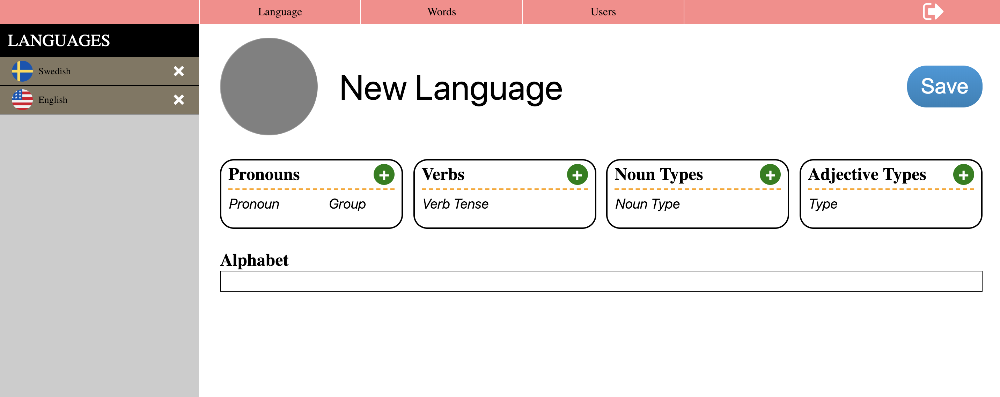</p>

On the top, there is a menu with three tabs, namely "Language", "Words" and "Users". Each of them loads another page where save/edit/remove operations can be executed. At the top-right, there is an icon to sign-out.

On the left, existing languages are shown. If one of them is clicked, its data will be shown on the right and the UI will go into edit mode. So any performed changes on the edited language will be saved into the database if the user clicks to the "Save" button. Otherwise, if the UI is not in the edit mode, clicking to the "Save" button will create a new language. Once the UI goes into the edit mode, in order to go to normal mode, the user must go to another tab and then click to the "Language" tab. The same applies also for the Words tab and Users tab.

Below, you can see how the screen looks like when the user clicks to "Swedish" in the left menu and goes into the edit mode.

<p align="center">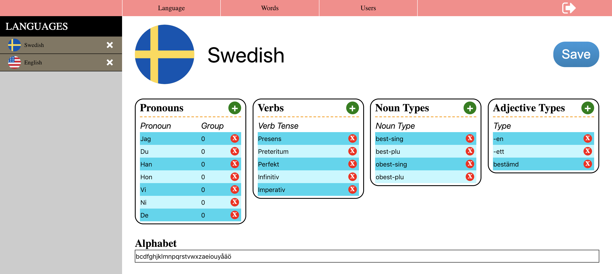</p>

To change the icon, click on the circle left to the name of the language. This is the same for users and words as well.

### Words page

Here is the word page in normal mode:

<p align="center">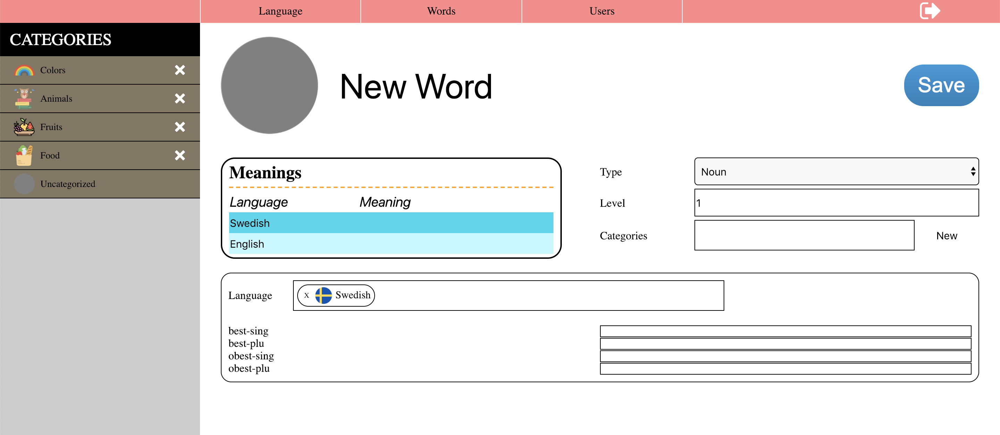</p>

This time, the left menu is a bit different than what we had in the Language tab. Here, word categories are shown to the user. If a user clicks to one of those categories and if there are at least one word which belongs to this category, then the category will be expanded and words belonging to this category will be shown as can be seen in the picture below:

<p align="center">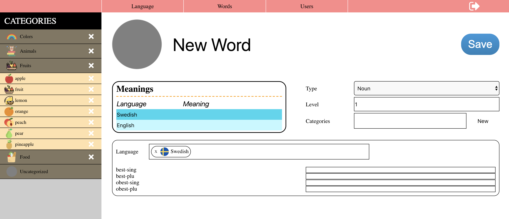</p>

Now, let's click to a word and see this word in edit mode

<p align="center">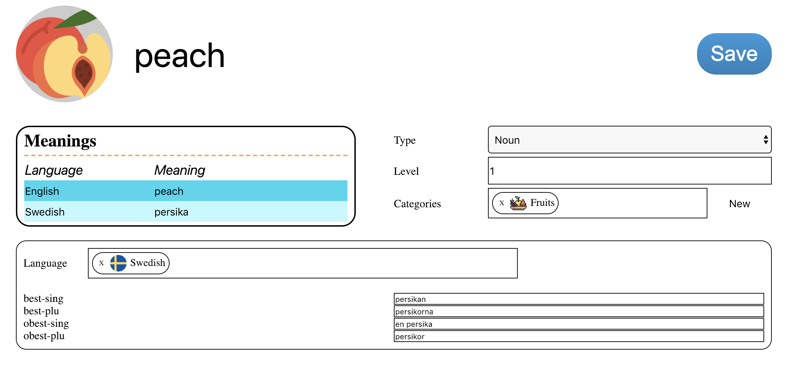</p>

The "New" button that appears next to the Categories label is to create a new category. There is no dedicated page to create and edit a category so the only way to create a new category is to use this button. It opens a popup which is responsible from creating a new category. This is how the screen looks like in edit mode for a noun. Below the same is shown for adjectives and verbs:

<p align="center">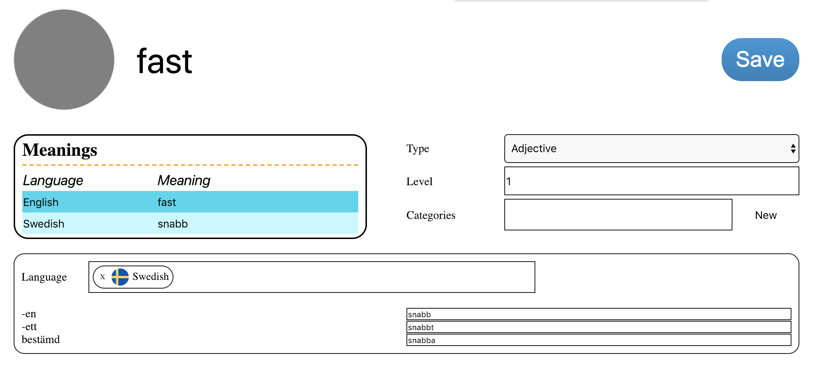</p>
<p align="center"><i>Screenshot of UI in edit mode for an adjective</i></p>

<p align="center">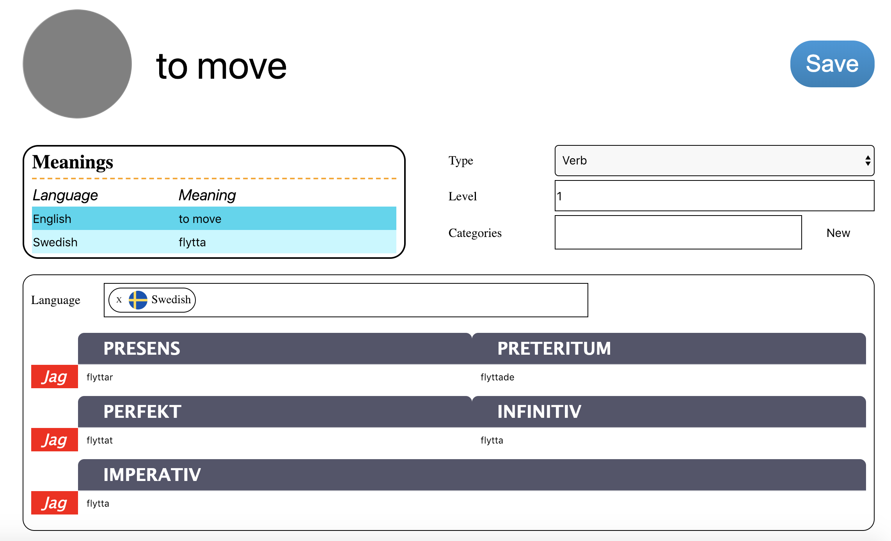</p>
<p align="center"><i>Screenshot of UI in edit mode for a verb</i></p>

In the bottom frame, the language can be changed to add/edit the forms of the word in different languages. Below, you can see an example for the word "to move". English is selected as the language and its forms in English are added.

<p align="center">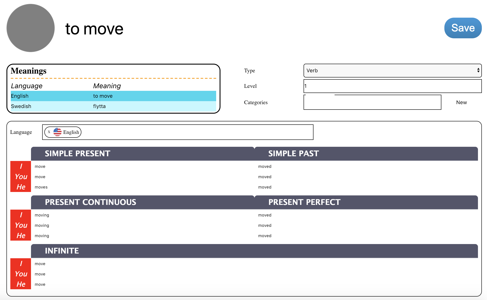</p>
<p align="center"><i>Screenshot of UI in edit mode for the verb "to move" (its forms in English are added)</i></p>

### Users page

Users page can be used to add/edit/remove a user and also to manage the assignment of words to the users. In other words, a word can be assigned to a user or a word can be removed from a user. When this user will use the mobile application to practice, (s)he will only see the words which have been assigned to him/her.

This is the initial view of the users page:

<p align="center">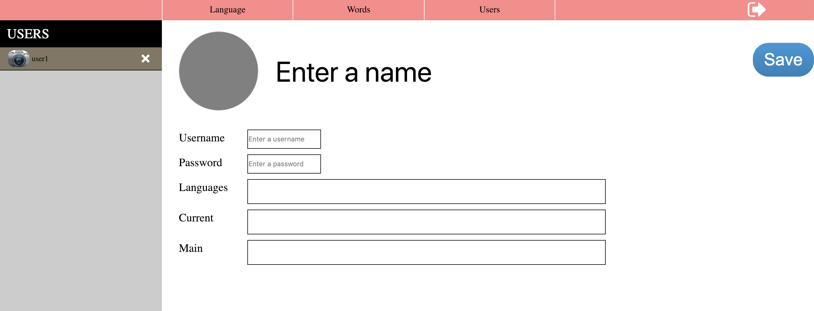</p>

The following is how the page looks like when it is in edit mode:

<p align="center">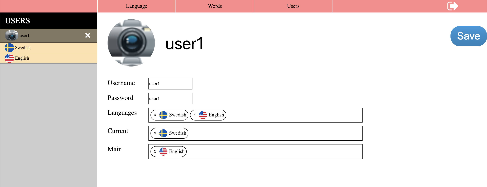</p>

When a user is clicked on the left menu, it expands and shows the languages that have been attached to the user. By clicking to one of those languages we can manage the assignment of words for this user for this language. After clicking to a language, this is the screen that we reach:

<p align="center">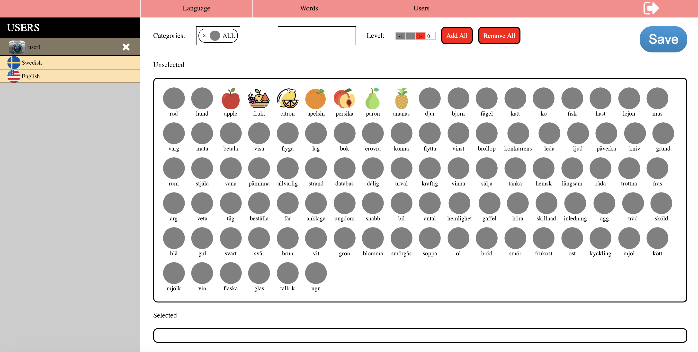</p>

By using the components on top, you can filter words by categories and levels. Then, dragging a word from the "unselected" frame to the "selected" frame assigns the word to the user and doing the opposite would unassign. Also, "Add All" and "Remove All" buttons can be used, this would assign/remove all words which are not filtered out. Below, you can see a screenshot where only words belonging to "Fruits" category are shown and some of them are assigned to the user.

<p align="center">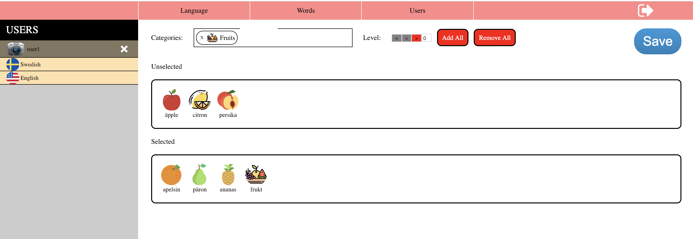</p>

Then, by pressing the "Save" button we can commit the changes.

## <a name="mobile-app-section"></a>Mobile Application

This component is a mobile application built by using Cordova. This is the application a user uses for practicing words that have been assigned to him/her. When running the application on phone, if the user was not logged in before, the following screen will appear:

<p align="center">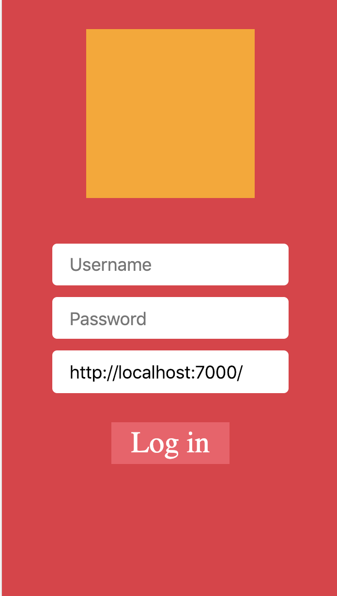</p>

Here, the username and password is the same with what have been used for AdminUI. In the last textbox, the URL to be used should be written. This will be used to communicate with the server. To make them able to connect, the computer where the server is running and the mobile phone should be connected to same WiFi. Then, check the local IP of the computer and replace "localhost" with this IP address. If the user is logged in before, this screen will not appear and the user will immediately see the main page, which is shown below.

<p align="center">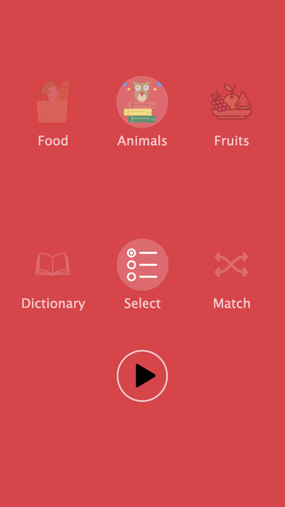</p>

Here, there is an unvisible top menu which can be brought to the screen by moving down a finger from the top edge. Then the top menu will appear as the following:

<p align="center">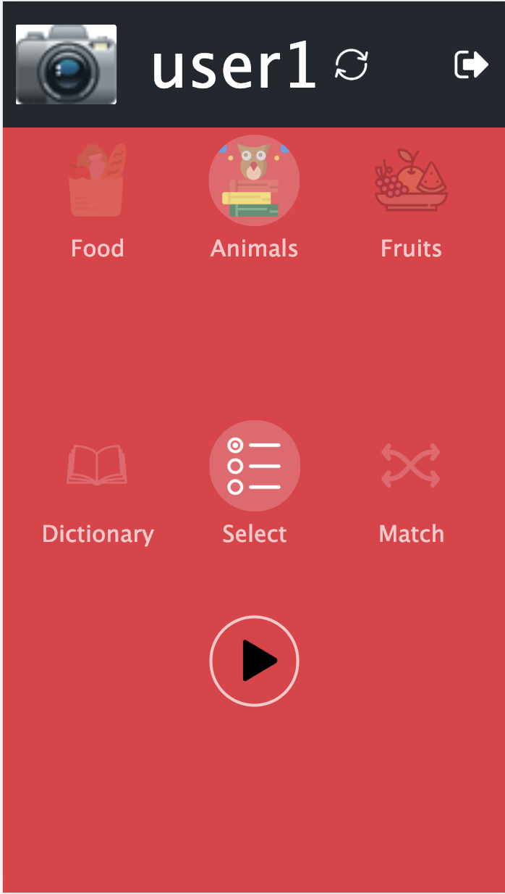</p>

This menu can be removed from the screen by just the opposite gesture. In this menu, click the icon on the right to log out and the refresh icon can be clicked to retrieve the latest database from the server (so the data in the phone will be synchronized with the server).

There are two components in this main screen. Those components work by dragging gesture, they can be dragged to left and right. By dragging, another icon can be brought to the center and highlighted and this is how to make a selection. The first component is used to select the word category that the user will be exercising on. The second component is used to pick the exercise type. Then, by pressing the button on down, the exercise can be started. There are four kinds of exercises: "Dictionary", "Select", "Match" and "Write". Those exercises will be explained in the following sections.

### Dictionary

This is not really an exercise but a way to see different forms of words and practice them by reading. The dictionary page looks like the following (left one is a screenshot for a noun and the right one is for a verb):

<p align="center">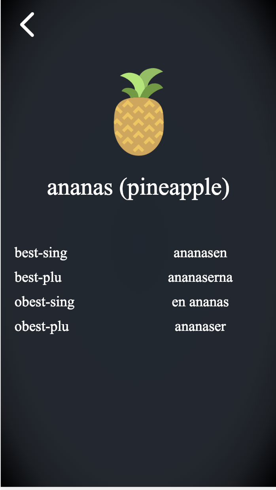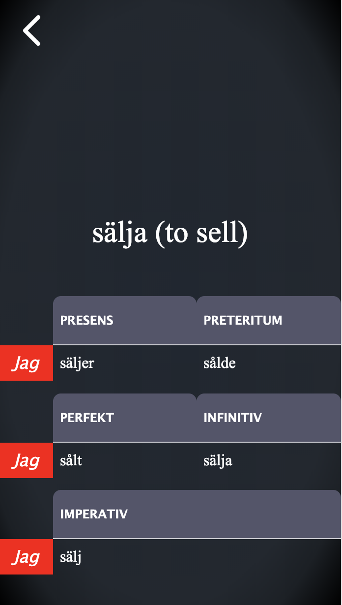</p>

User can go to the next word or previous word by dragging the page to the left or to the right. If it is not possible to drag it to right, it means that the user reached to the end of the words. Back button on the top left can be clicked to return to the main page.

### Select

In this exercise, for a word, the application gives four options and the user is expected to pick the correct option. When user gives the correct answer, the next question appears.

<p align="center">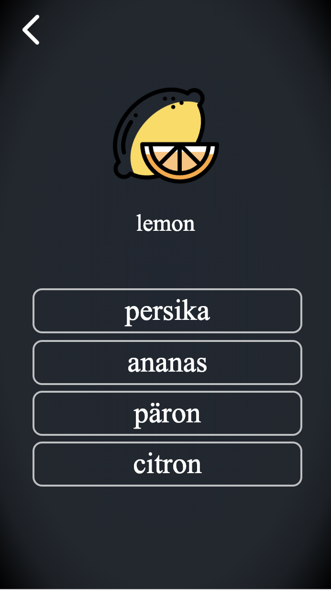</p>

### Match

In this exercise, a user is expected to match the words in the left column with the words in the right column. User presses to a word in the left column first and then (s)he is expected to click the matching word at the right column. If those two words are really matching, they will turn into green and disappear from the columns.

<p align="center">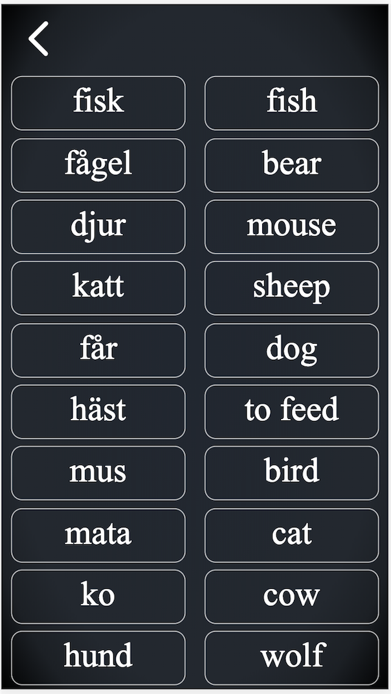</p>

### Write

In this exercise, the user is expected to write a word in the practiced language and in the requested form by clicking to letters. 

<p align="center">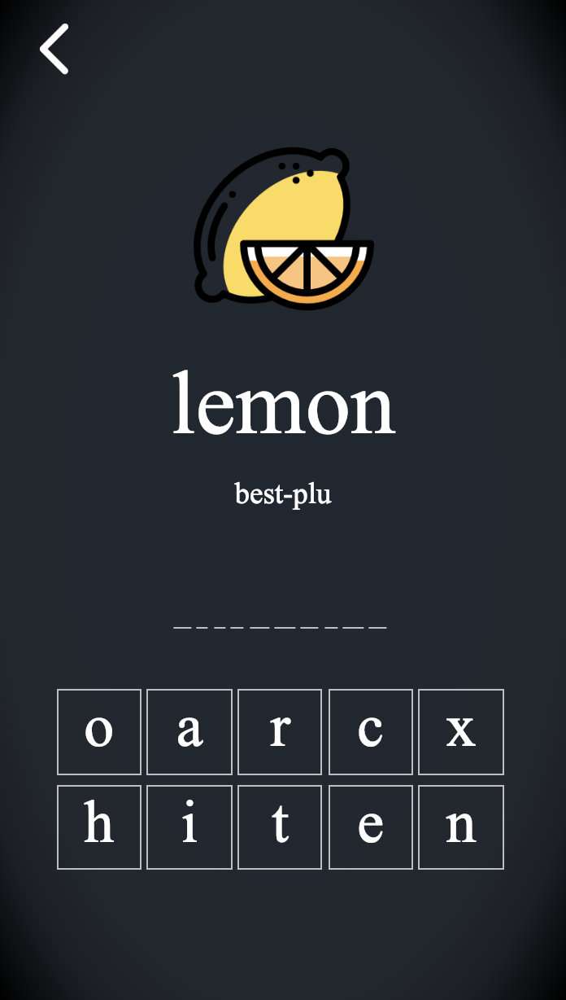</p>

For example, for the case which is seen in the screenshot above, the user is expected to write "lemon" in Swedish and in "bestämd plural" form (definite plural), which is "citronerna". 


## <a name="crawler-section"></a>Word Crawler

This is not documented and added to the repository yet. This will be done in the future.

